# 1.- CONOCIENDO EL SERVIDOR LINUX

En este apartado se documentan los comandos pedidos en la tarea para conocer y administrar el servidor Linux.  Cada comando tiene su explicación y su captura correspondiente.  

---

### 1. Nombre del host

**Comando:** `hostname`  
Muestra el nombre del host actual del sistema.

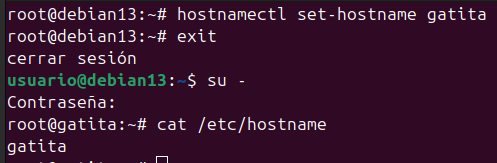

**Comando:** `hostname -I`  
Muestra las direcciones IP asignadas al host.

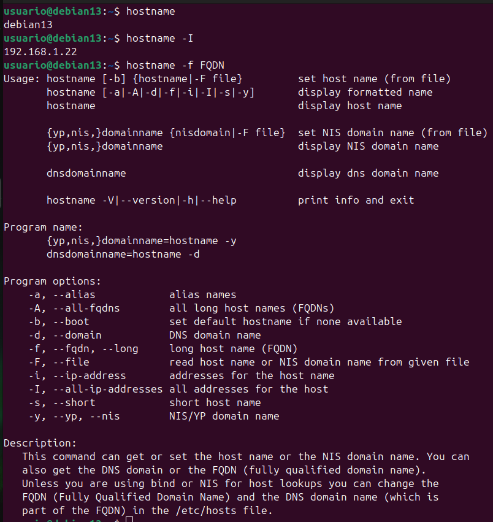

**Comando:** `hostname -f`  
Muestra el FQDN (Fully Qualified Domain Name), es decir, el nombre de host completo con dominio.


**Comando:** `hostnamectl`  
Herramienta moderna para ver y cambiar el hostname sin reiniciar. Pertenece a `systemd`.


**Comando:** `cat /etc/hostname`  
Muestra el nombre de host guardado en el archivo de configuración.


**Comando:** `hostnamectl set-hostname NuevoNombre`  
Permite cambiar el nombre del host de forma permanente (requiere cerrar sesión para aplicar).

---

### 2. Versión del sistema

**Comando:** `lsb_release -a`  
Muestra la distribución de Linux y su versión.

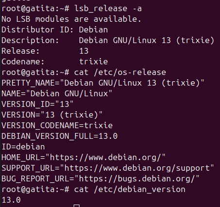

**Comando:** `cat /etc/os-release`  
Muestra información detallada de la distribución.


**Comando:** `cat /etc/debian_version`  
Muestra la versión de Debian.


---

### 3. Versión del núcleo y arquitectura

**Comando:** `uname -a`  
Muestra información completa del kernel, arquitectura y compilación.

**Comando:** `uname -r`  
Muestra únicamente la versión del kernel.


---

### 4. Memoria RAM

**Comando:** `free` y `free -h`  
Muestran el uso de la memoria RAM y swap. La opción `-h` lo muestra en formato legible (MB/GB).

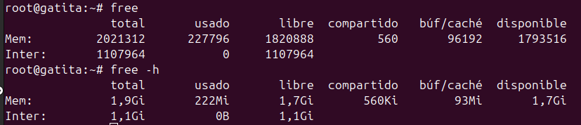

---

### 5. CPU

**Comando:** `lscpu`  
Muestra información detallada de la CPU: arquitectura, núcleos, hilos, etc.

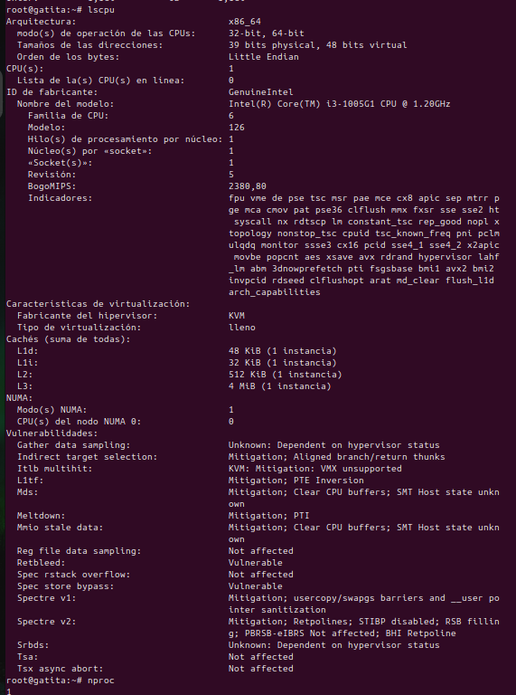

**Comando:** `nproc`  
Muestra el número de procesadores lógicos disponibles.


---

### 6. Discos y particiones

**Comando:** `lsblk` y `lsblk -f`  
Muestran los dispositivos de bloque y su información de sistema de archivos.

**Comando:** `sudo fdisk -l`  
Lista las particiones y discos del sistema.

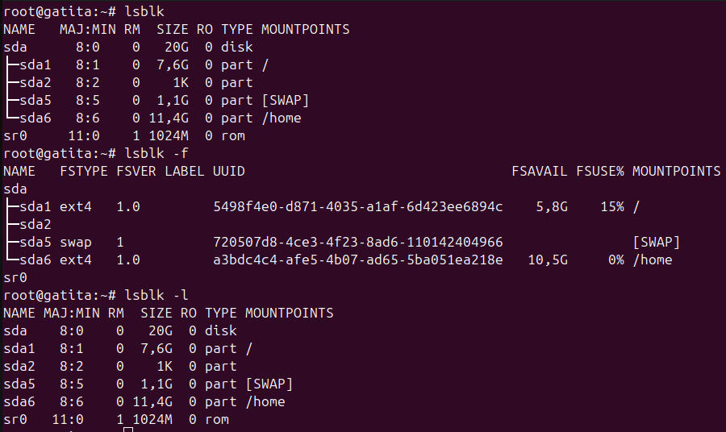

---

### 7. Sistemas montados

**Comando:** `df -h`  
Muestra el uso de disco de cada sistema de archivos montado.

**Comando:** `df -hT`  
Incluye el tipo de sistema de archivos.

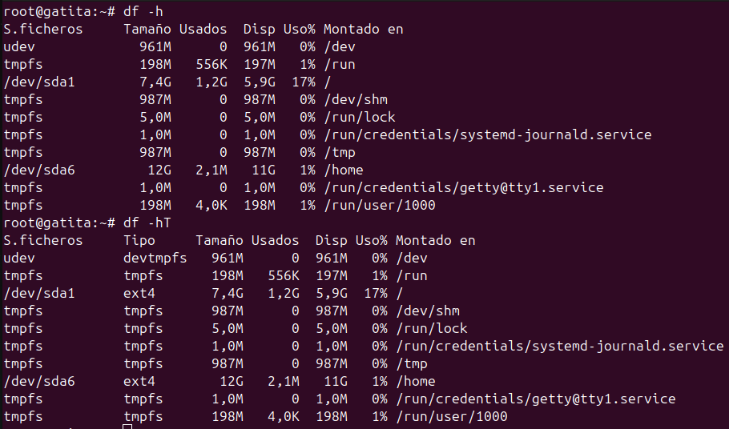

---

### 8. Tamaño de carpetas

**Comando:** `du -h /home/`  
Muestra el tamaño de las carpetas dentro de `/home`.

**Comando:** `du -hs /home`  
Muestra el tamaño total de `/home`.

**Comando:** `du -hs /home/*`  
Muestra el tamaño de cada subcarpeta dentro de `/home`.

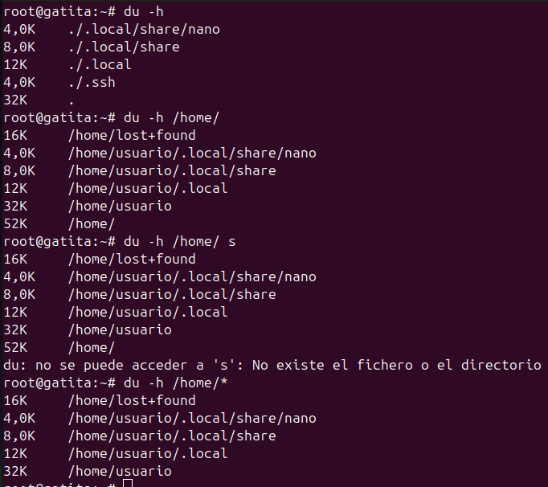

---

### 9. Usuarios y grupos del sistema

**Comando:** `cat /etc/passwd` y `getent passwd`  
Muestran la lista de usuarios del sistema.

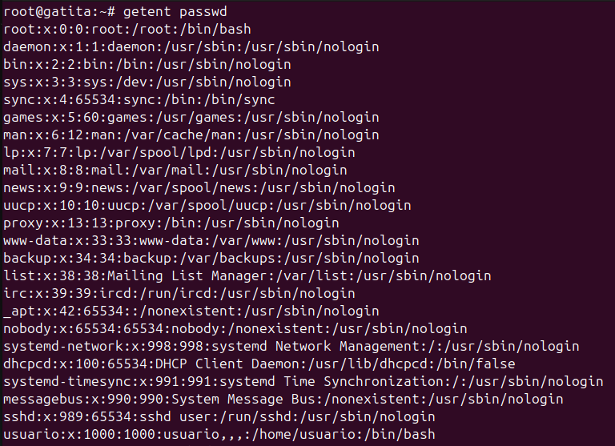

**Comando:** `cat /etc/shadow` y `getent shadow`  
Muestran las contraseñas encriptadas (requiere permisos de root).

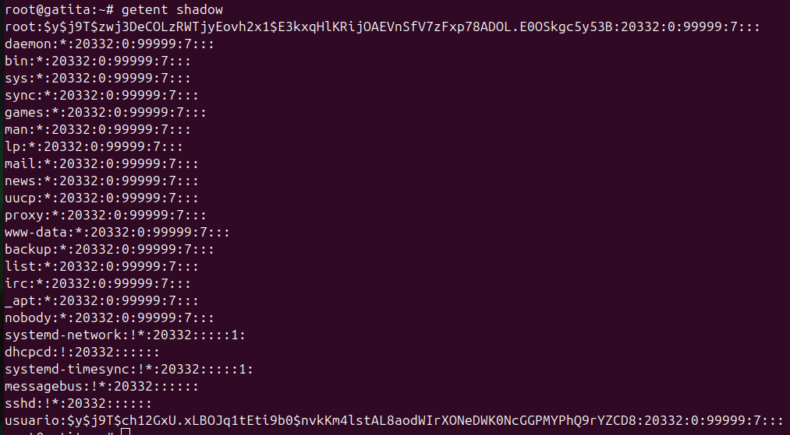

**Comando:** `cat /etc/group` y `getent group`  
Muestran los grupos existentes.

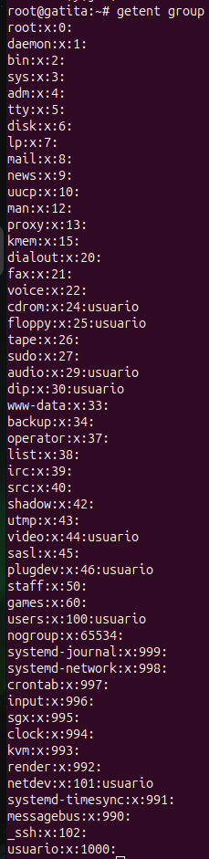

**Comando:** `cat /etc/gshadow` y `getent gshadow`  
Muestran contraseñas de grupos.

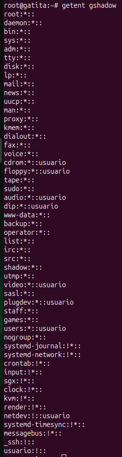

**Comando:** `cat /etc/nsswitch.conf`  
Indica dónde busca el sistema la información de usuarios, grupos, hosts, etc. (archivos locales, DNS, etc.).

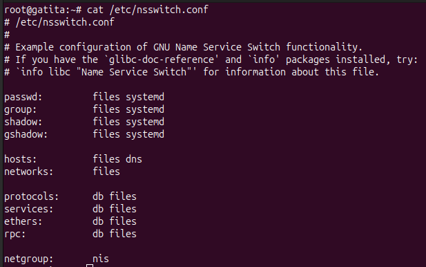

---

### 10. Información de la red

**Comando:** `ip a`  
Muestra todas las interfaces de red, direcciones IP y estado (UP/DOWN).

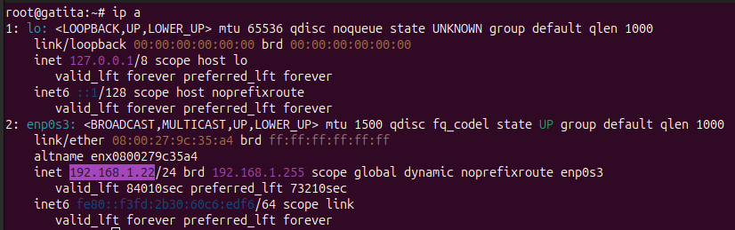

**Comando:** `ip r`  
Muestra la tabla de rutas y la puerta de enlace predeterminada.

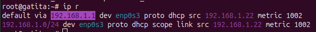

**Comando:** `ping -c 4 <PuertaDeEnlace>`  
Verifica conectividad con el gateway y mide tiempo de respuesta (avg ~1ms en red local).

**Comando:** `ping -c 4 google.es`  
Verifica conectividad a Internet (avg < 20ms en condiciones normales).

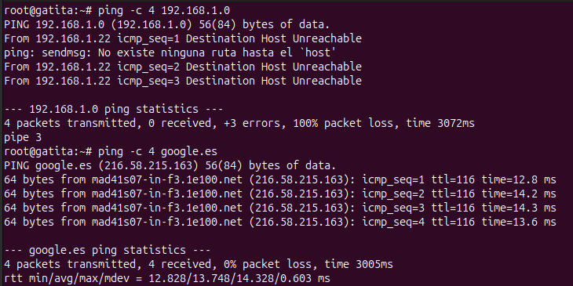

---

### 11. Comprobar DNS

**Comando:** `nslookup google.es`  
Muestra qué servidor DNS responde la consulta y su IP.

**Comando:** `nslookup 8.8.8.8`  
Muestra quién es el propietario de esa IP.

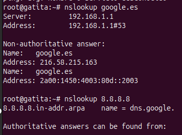

---

### 12. Configuración de la red

**Comando:** `cat /etc/network/interfaces`  
Muestra la configuración de las interfaces de red.

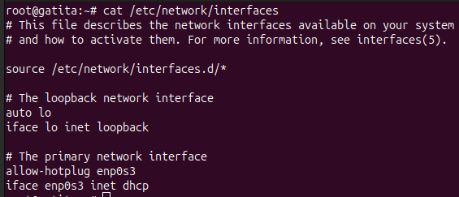

---

### 13. Configuración tradicional de DNS

**Comando:** `cat /etc/resolv.conf`  
Muestra los servidores DNS configurados en el sistema.

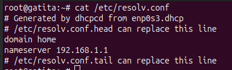

---

### 14. Reiniciar la red

**Comando:**  
```bash
systemctl status networking
systemctl restart networking

---

### 15. Bajar o subir una tarjeta de red

**Comandos:**
```ifdown eth0
```ifup eth0
```ifdown eth0 && ifup eth0
Permiten desactivar y reactivar manualmente una interfaz de red.
