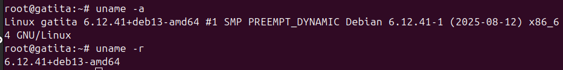
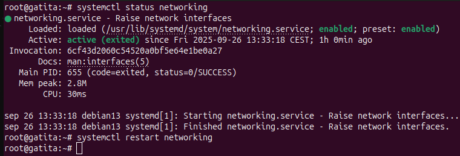
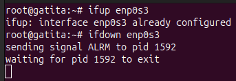

# 1.- CONOCIENDO EL SERVIDOR LINUX 🖥️🐧

En este apartado se documentan los comandos pedidos en la tarea para conocer y administrar el servidor Linux.  Cada comando tiene su explicación y su captura correspondiente.  

---

### 1. Nombre del host 🏷️

* **Comando:** `hostname`  
Muestra el nombre del host actual del sistema.

**Comando:** `hostname -I`  
Muestra las direcciones IP asignadas al host.

**Comando:** `hostname -f`  
Muestra el FQDN (Fully Qualified Domain Name), es decir, el nombre de host completo con dominio.

  

  

**Comando:** `hostnamectl set-hostname NuevoNombre`  
Permite cambiar el nombre del host de forma permanente (requiere cerrar sesión para aplicar).

**Comando:** `cat /etc/hostname`  
Muestra el nombre de host guardado en el archivo de configuración.

---

### 2. Versión del sistema 🖥️

**Comando:** `lsb_release -a`  
Muestra la distribución de Linux y su versión.

**Comando:** `cat /etc/os-release`  
Muestra información detallada de la distribución.

**Comando:** `cat /etc/debian_version`  
Muestra la versión de Debian.

---

### 3. Versión del núcleo y arquitectura ⚙️🔧

**Comando:** `uname -a`  
Muestra información completa del kernel, arquitectura y compilación.

**Comando:** `uname -r`  
Muestra únicamente la versión del kernel.

---

### 4. Memoria RAM 🧠💾

**Comando:** `free` y `free -h`  
Muestran el uso de la memoria RAM y swap. La opción `-h` lo muestra en formato legible (MB/GB).

---

### 5. CPU 🖥️💨

**Comando:** `lscpu`  
Muestra información detallada de la CPU: arquitectura, núcleos, hilos, etc.

**Comando:** `nproc`  
Muestra el número de procesadores lógicos disponibles.

---

### 6. Discos y particiones 💽

**Comando:** `lsblk`  
Muestra los dispositivos de bloque (discos, particiones, etc.) en forma de árbol, indicando su tamaño y relación entre ellos.

**Comando:** `lsblk -f`  
Muestra la misma información que `lsblk`, pero añade detalles sobre el sistema de archivos (tipo, UUID, etiqueta).

**Comando:** `fdisk -l`  
Lista las particiones y discos detectados en el sistema, mostrando tamaños, sectores y tipo de partición.

---

### 7. Sistemas montados 📂

**Comando:** `df -h`  
Muestra el uso de disco de cada sistema de archivos montado.

**Comando:** `df -hT`  
Incluye el tipo de sistema de archivos.

---

### 8. Tamaño de carpetas 📁

**Comando:** `du -h`  
Muestra el tamaño de todos los archivos y directorios de forma recursiva en la carpeta donde se ejecute, en formato legible (KB, MB, GB).

**Comando:** `du -h /home/`  
Hace lo mismo que el anterior, pero mostrando el tamaño de todos los archivos y subdirectorios dentro de `/home`.

**Comando:** `du -hs /home s`  
Muestra el tamaño total de la carpeta `/home` sin desglosar el tamaño de cada subcarpeta.

**Comando:** `du -hs /home/*`  
Muestra el tamaño de cada subcarpeta dentro de `/home`, en formato resumido.

---

### 9. Usuarios y grupos del sistema 👥🔒

**Comandos:** `cat /etc/passwd` y `getent passwd`  
Muestran la lista de usuarios del sistema.

**Comandos:** `cat /etc/shadow` y `getent shadow`  
Muestran las contraseñas encriptadas (requiere permisos de root).

**Comandos:** `cat /etc/group` y `getent group`  
Muestran los grupos existentes.

**Comandos:** `cat /etc/gshadow` y `getent gshadow`  
Muestran contraseñas de grupos.

**Comando:** `cat /etc/nsswitch.conf`  
Indica dónde busca el sistema la información de usuarios, grupos, hosts, etc. (archivos locales, DNS, etc.).

---

### 10. Información de la red 🌐🌎

**Comando:** `ip a`  
Muestra todas las interfaces de red, direcciones IP y su estado (UP/DOWN).

**Comando:** `ip r`  
Muestra la tabla de rutas y la puerta de enlace predeterminada.

**Comando:** `ping -c 4 <PuertaDeEnlace>`  
Verifica conectividad con el gateway y mide tiempo de respuesta (avg ~1ms en red local).

**Comando:** `ping -c 4 google.es`  
Verifica conectividad a Internet (avg < 20ms en condiciones normales).

---

### 11. Comprobar DNS 🔍

**Comando:** `nslookup google.es`  
Muestra qué servidor DNS responde la consulta y su IP.

**Comando:** `nslookup 8.8.8.8`  
Muestra quién es el propietario de esa IP.

---

### 12. Configuración de la red ⚙️

**Comando:** `cat /etc/network/interfaces`  
Muestra la configuración de las interfaces de red.

---

### 13. Configuración tradicional de DNS 🌐

**Comando:** `cat /etc/resolv.conf`  
Muestra los servidores DNS configurados en el sistema.

---

### 14. Reiniciar la red 🔄

**Comando:** `systemctl status networking`
Muestra el estado actual del servicio de red, indicando si está activo, inactivo o fallando.

**Comando:** `systemctl restart networking`
Reinicia el servicio de red, aplicando cualquier cambio de configuración realizado.

---

### 15. Bajar o subir una tarjeta de red 🖧⬆️⬇️

**Comando:** `ifup eth0`
Activa la interfaz de red eth0, levantándola con su configuración.

**Comando:** `ifdown eth0`
Desactiva la interfaz de red eth0, dejándola inactiva.

**Comando:** `ifdown eth0 && ifup eth0`
Primero desactiva y luego vuelve a activar la interfaz eth0, aplicando cualquier cambio de configuración.

